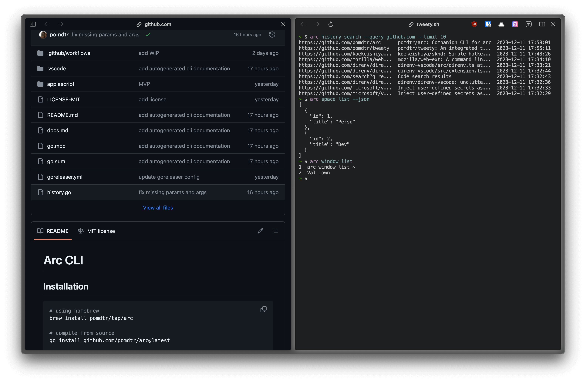

# Arc CLI

Arc companion CLI.



## Installation

```sh
# using homebrew
brew install pomdtr/tap/arc

# compile from source
go install github.com/pomdtr/arc@latest
```

or download the binary from the [releases page](https://github.com/pomdtr/arc/releases).

See the `sunbeam completion` command to generate completion scripts for your shell.

## Usage

See the [autogenerated docs](docs.md) for more information on the available commands.

## See Also

- [Tweety](https://github.com/pomdtr/tweety) - An integrated Terminal for your Browser.
- [Sunbeam](https://sunbeam.sh) - Spotlight for the command line.
